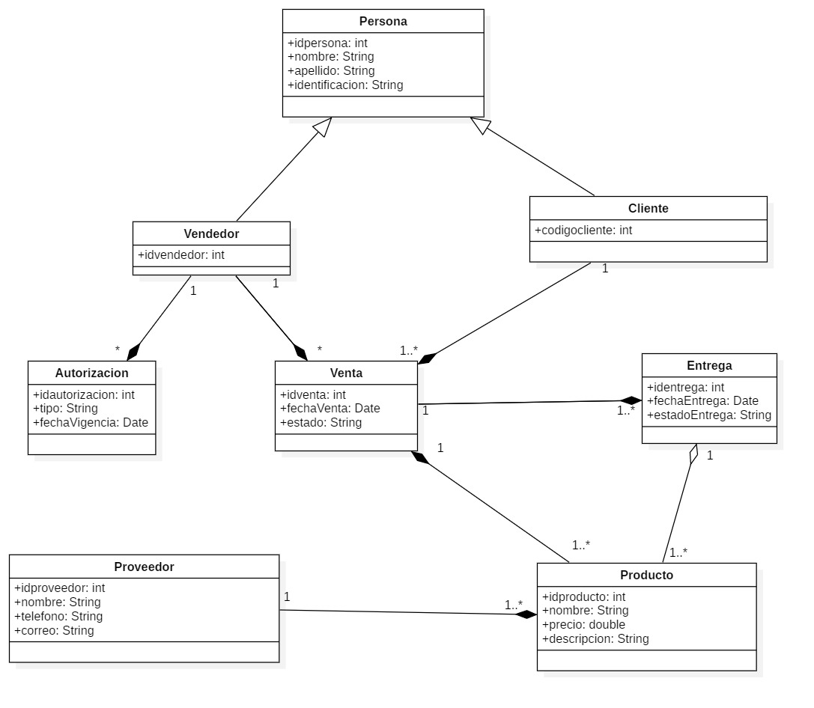
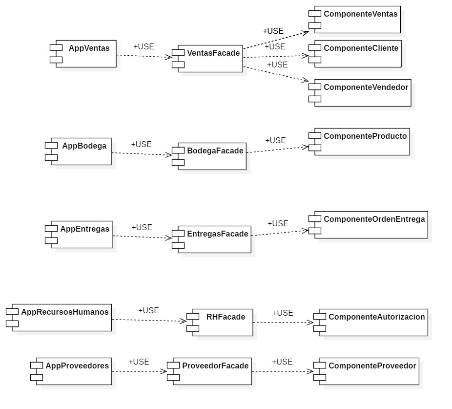

# PoliMarket - Sistema de Gestión Empresarial

**Entrega de Actividad 2 Temas Avanzados de Diseño de Software - Ejercicio Práctico PoliMarket**

**Autores:**

- Yoiner Montoya Cabrera
- William Yesid Granada Pedroza
- Johan Sebastián Giraldo Cañas

**Institución:** Politécnico Grancolombiano  
**Docente:** Wilson Eduardo Soto Moreno  
**Fecha:** 29 de Julio de 2025

## Descripción del Proyecto

En la empresa PoliMarket, se cuenta con diferentes áreas de negocio, cada una con sistemas de información separados, como son: bodega, ventas, recursos humanos, proveedores y entregas. Los vendedores deben ser autorizados por recursos humanos para que puedan interactuar con los demás sistemas de la organización. Los vendedores se conectan con ventas para realizar las correspondientes acciones de las tareas asignadas, donde cuentan con un listado de los posibles clientes y de los productos disponibles. Asimismo, ventas se conecta con la bodega para poder ver la disponibilidad de los productos. De la misma manera, bodega se conecta con proveedores para poder tener un registro de los productos adquiridos por la empresa y saber a qué empresa solicitar más cuando se terminen las existencias en la bodega. Finalmente, entregas se comunica con ventas para saber qué productos debe entregar y a quién, y también se comunica con bodega para registrar la salida de productos del stock.

## Requisitos Funcionales

| **Nº**  | **Requisito funcional**                                           | **Componentes implicados**                                                  |
| ------- | ----------------------------------------------------------------- | --------------------------------------------------------------------------- |
| **RF1** | Autorizar vendedores para operar dentro del sistema               | ComponenteAutorizacion, ComponenteVendedor                                  |
| **RF2** | Registrar ventas de productos a clientes                          | ComponenteVentas, ComponenteCliente, ComponenteProducto, ComponenteVendedor |
| **RF3** | Calcular totales, generar factura y agregar productos a una venta | ComponenteVentas, ComponenteProducto                                        |
| **RF4** | Consultar historial de órdenes del cliente                        | ComponenteCliente, ComponenteHistoricoOrden                                 |
| **RF5** | Consultar disponibilidad de stock de productos                    | ComponenteProducto                                                          |

## Definición de Componentes

| **Componente**             | **Funcionalidades**                                                                                          |
| -------------------------- | ------------------------------------------------------------------------------------------------------------ |
| **ComponenteVentas**       | `registrarVenta(cliente, productos, cantidades)`, `calcularTotal()`, `generarFactura()`, `agregarProducto()` |
| **ComponenteCliente**      | `consultarHistorialOrdenes()`, `listarProductosDisponibles()`                                                |
| **ComponenteVendedor**     | `listarClientes()`, `estaAutorizado()`                                                                       |
| **ComponenteAutorizacion** | `esVigente()`, `obtenerEstadoAutorizacion()`                                                                 |
| **ComponenteProducto**     | `estaDisponible(cantidad)`, `calcularSubtotal()`                                                             |
| **ComponenteProveedor**    | `listarProductosSuministrados()`, `obtenerInfoSuministro()`                                                  |
| **ComponenteOrdenEntrega** | `actualizarEstado(nuevoEstado)`, `generarResumen()`                                                          |

### **Figura 1: Diagrama de Clases**



### **Figura 2: Diagrama de Componentes**



## Arquitectura del Sistema

El proyecto sigue una **arquitectura en capas (Clean Architecture)** con separación clara de responsabilidades:

```
Backend/
├── PoliMarket.Core/          # CAPA DE DOMINIO
│   ├── Entities/             # Entidades del dominio
│       ├── Persona.cs        # Clase base abstracta
│       ├── Vendedor.cs       # Hereda de Persona
│       ├── Cliente.cs        # Hereda de Persona
│       ├── Producto.cs       # Entidad Producto con lógica de negocio
│       ├── Venta.cs          # Entidad Venta
│       ├── Autorizacion.cs   # Gestión de autorizaciones
│       ├── Entrega.cs        # Gestión de entregas
│       └── Proveedor.cs      # Gestión de proveedores
│
│
├── PoliMarket.DataAccess/    # CAPA DE ACCESO A DATOS
│   ├── Context/              # Contexto de Entity Framework
│   │   └── PoliMarketDbContext.cs # Configuración EF Core
│   ├── Contracts/            # Interfaces de repositorios
│   │   └── IGenericRepository.cs
│   └── Repositories/         # Implementación de repositorios
│       └── GenericRepository.cs # Repository pattern genérico
│
├── PoliMarket.Business/      # CAPA DE LÓGICA DE NEGOCIO
│   ├── Contracts/            # Interfaces de servicios
│   │   ├── IComponenteVentas.cs     # RF2, RF3
│   │   ├── IComponenteVendedor.cs   # RF1
│   │   ├── IComponenteCliente.cs    # RF4
│   │   └── IComponenteProducto.cs   # Operaciones de productos
│   ├── Services/             # Implementación de servicios
│   │   ├── ComponenteVentas.cs      # Lógica de ventas y facturas
│   │   ├── ComponenteVendedor.cs    # Lógica de autorización
│   │   ├── ComponenteCliente.cs     # Lógica de historial
│   │   └── ComponenteProducto.cs    # Lógica de productos
│   └── DTOs/                 # Objetos de transferencia de datos
│       ├── FacturaDto.cs     # DTO para facturas
│       ├── ProductoVentaDto.cs
│       ├── EstadoAutorizacionDto.cs
│       └── DisponibilidadStockDto.cs
│
└── PoliMarket.API/           # CAPA DE PRESENTACIÓN
    ├── Controllers/          # Controladores Web API
    │   ├── VentasController.cs      # Endpoints RF2, RF3
    │   ├── VendedoresController.cs  # Endpoints RF1
    │   ├── ClientesController.cs    # Endpoints RF4
    │   └── ProductosController.cs   # Endpoints productos
    ├── Program.cs            # Configuración de la aplicación
    └── appsettings.json      # Configuración de conexiones
```

## Tecnologías Utilizadas

- **Framework:** .NET 8.0
- **ORM:** Entity Framework Core
- **Base de datos:** SQL Server
- **Arquitectura:** Arquitectura en Capas (Clean Architecture)
- **Documentación:** Swagger
- **Logging:** Microsoft.Extensions.Logging
- **Inyección de dependencias:** Microsoft.Extensions.DependencyInjection

## Documentación de API

### **Endpoints Principales:**

#### ** Vendedores (RF1):**

- `GET /api/vendedores` - Listar vendedores
- `POST /api/vendedores/{id}/autorizar` - Autorizar vendedor
- `GET /api/vendedores/{id}/estado-autorizacion` - Estado de autorización

#### ** Ventas (RF2, RF3):**

- `POST /api/ventas` - Registrar venta
- `GET /api/ventas/{id}/total` - Calcular total
- `GET /api/ventas/{id}/factura` - Generar factura
- `POST /api/ventas/{id}/productos` - Agregar producto

#### ** Clientes (RF4):**

- `GET /api/clientes/{id}/historial-ordenes` - Historial de órdenes
- `GET /api/clientes` - Listar clientes

#### ** Productos (RF5):**

- `GET /api/productos` - Listar todos los productos
- `GET /api/productos/{productoId}` - Obtener producto específico
- `GET /api/productos/buscar?termino={busqueda}` - Buscar productos

_Sistema PoliMarket - Gestión Empresarial Integral_
